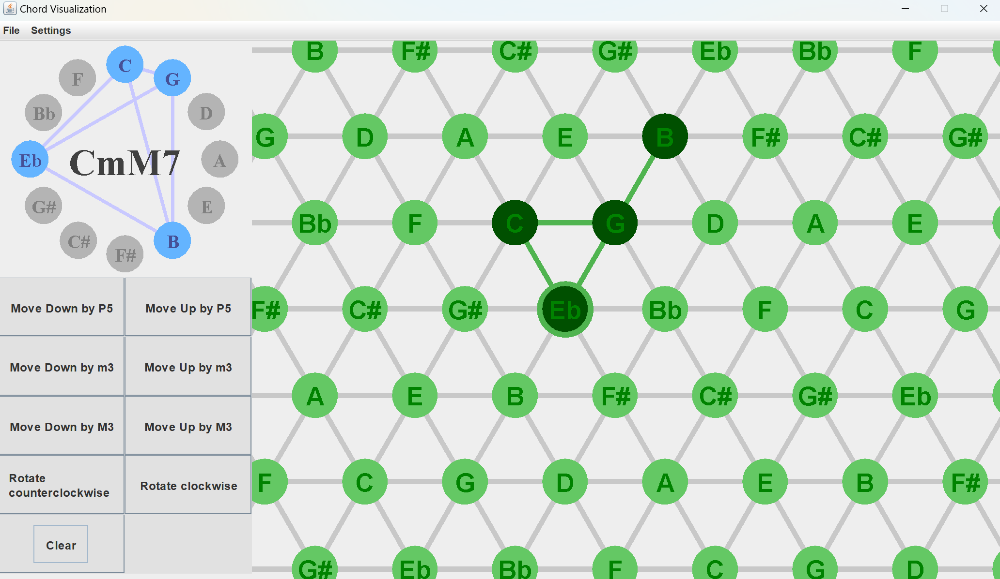
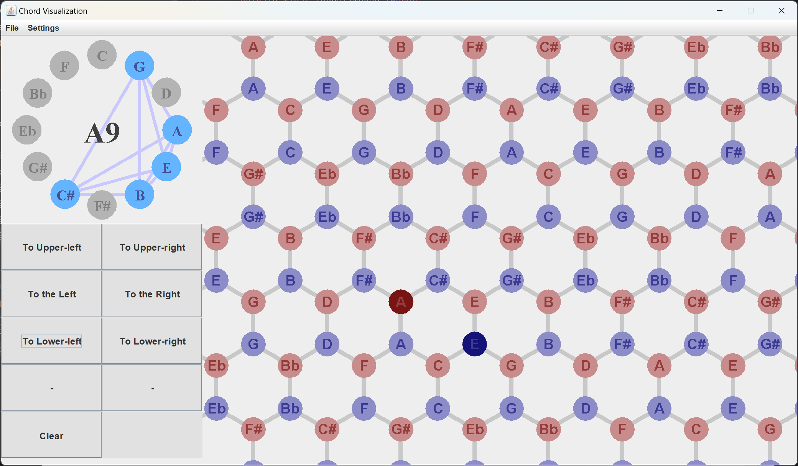

# Chord Visualization

As of now, this is a GUI that allows user to create, play, and apply operations to chords on a Tonnetz. 

## How does the visualization work

There are three forms of visualization in this program.

- **Tonnetz:** The panel on the right-hand side shows a Tonnetz structure. In this structure, two notes are connected when they form m3, M3 or P5 interval. Both cylinder (finite) and torus (infinite) version of Tonnetz are available. Visit https://en.wikipedia.org/wiki/Tonnetz to learn more.

- **Circle of fifths:** The panel on the left-hand side shows a circle of fifths. Each node here represents a pitch class, and forms P5 with any of their neighbors. Learn more on https://en.wikipedia.org/wiki/Circle_of_fifths. The panel also shows the structure of current chord. 

*Tonnetz*

*Infinite Tonnetz*

- **Dual-Tonnetz:** Use the settings menu to switch to the dual graph of the Tonnetz, where red and blue nodes represents major and minor triads respectively. Two triads are connected when they share 2 common notes.

*Dual-Tonnetz*

## Usage

Left click on notes to press. Use the control panel to apply operations to the pressed notes. These operations are:

- **Moving along edges:** On Tonnetz this means parallel movement by P5, M3 or m3 interval. On Dual-Tonnetz things are more interesting since chord structures change as they travel. 
- **Rotation:** Rotate all notes according to the rotation center. Right click to set rotation center. This operation is only supported on the cylindrical Tonnetz, and is only well-defined locally. It behaves in unexpected ways when the note group is too large, or when it touches right/left boundary of the Tonnetz. You can see the note group "converging" into a local chart of cylinder as you apply rotations, which I personally find very interesting.

You can change instrument in the settings menu. All instruments in general midi are supported.

The file menu currently does nothing, do not bother clicking it.